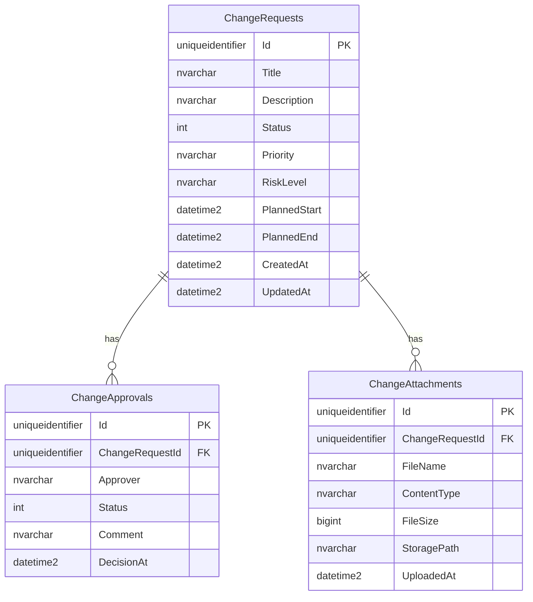
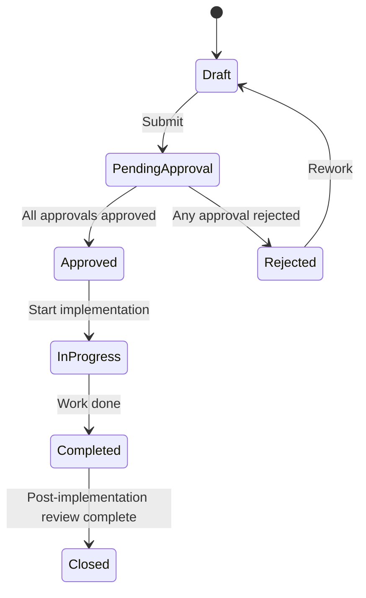

# Database Architecture & Workflow Roadmap

## Database Architecture Diagram

## Approval Workflow State Diagram

## Recommended Next Enhancements

1. Role-based authentication (Admin / Requestor / Approver)
2. JWT authentication for API access
3. Email notifications for submission/approval/rejection events
4. Audit logging (who/what/when for all mutating actions)
5. Soft delete + retention policy
6. Optimistic concurrency tokens on mutable entities
7. Background job queue for exports, notifications, and cleanup
